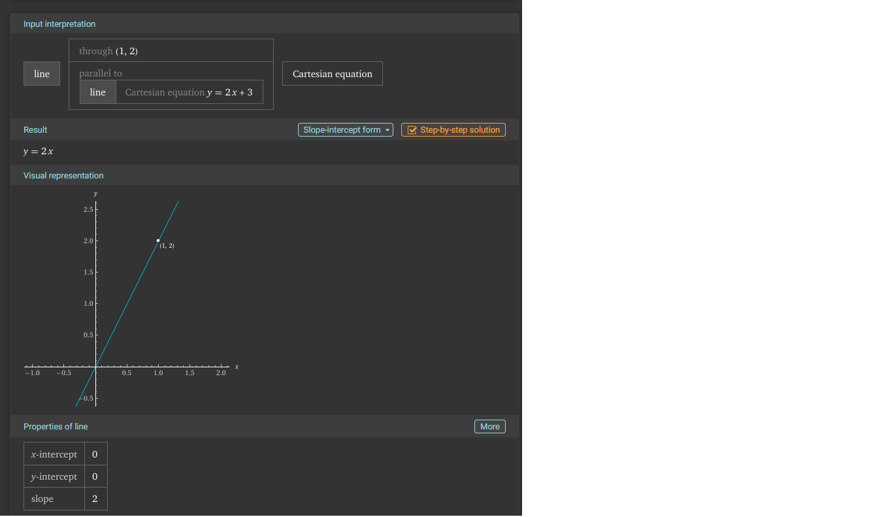
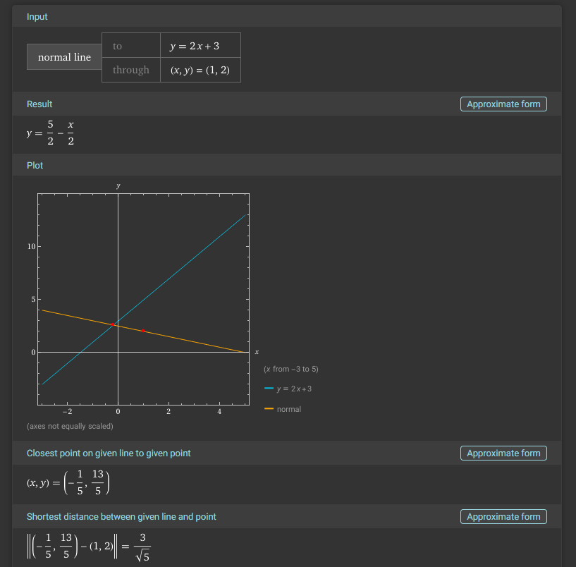
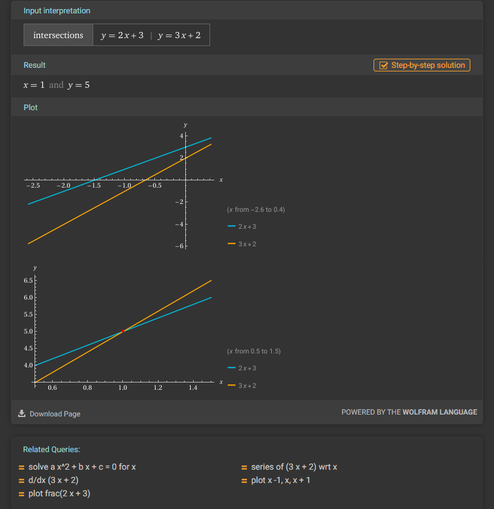
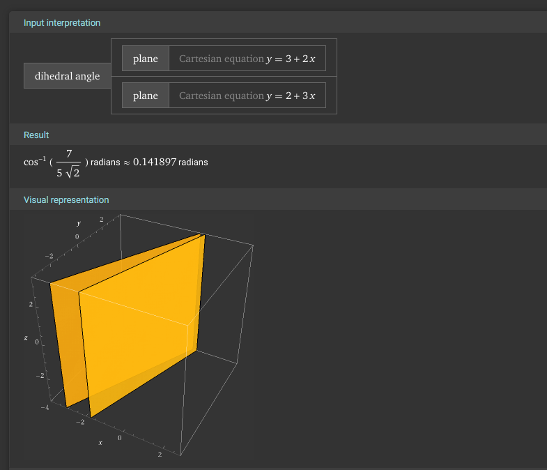
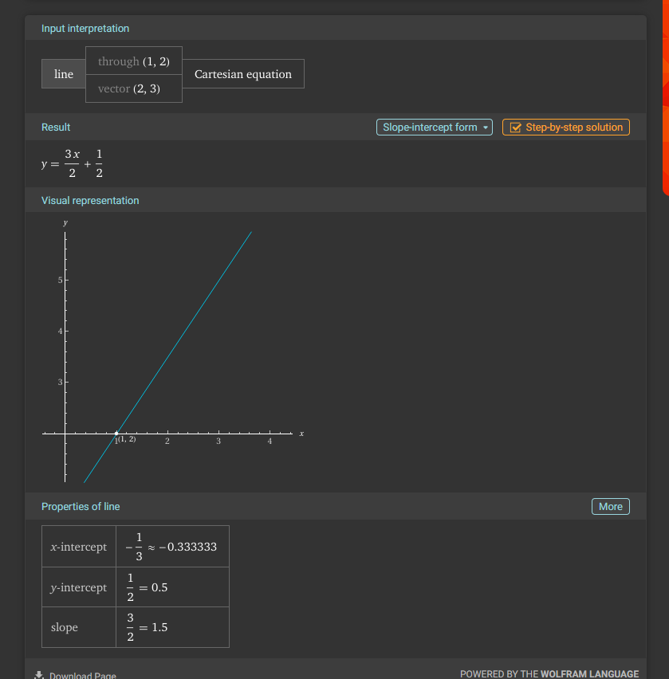
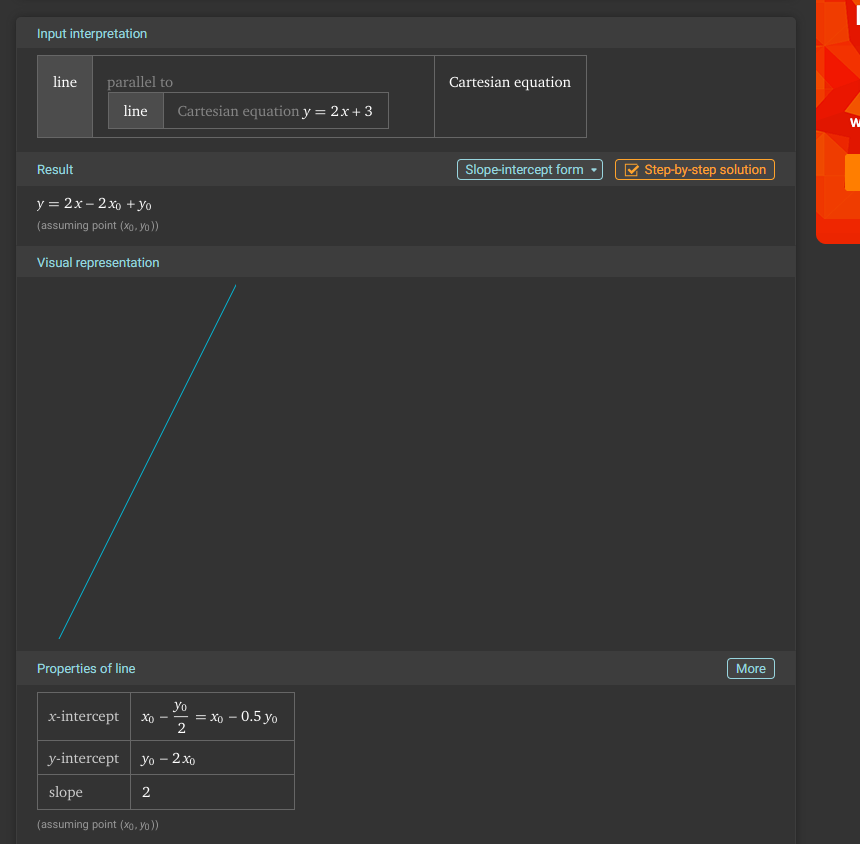
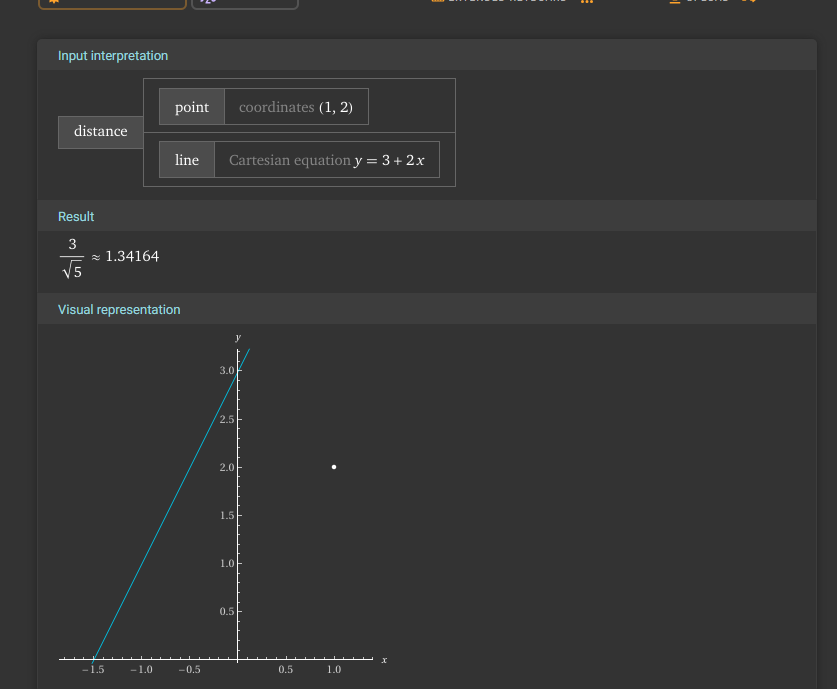
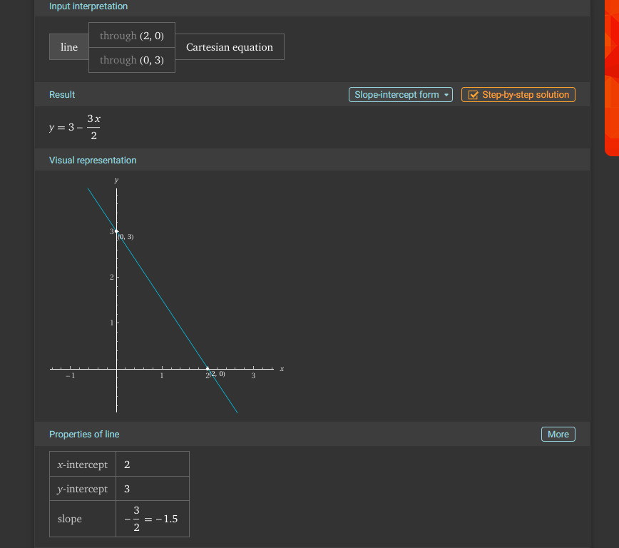
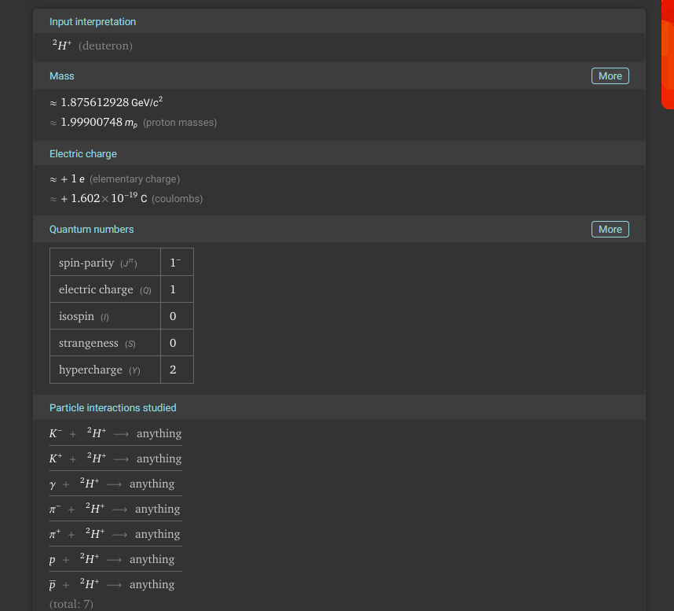
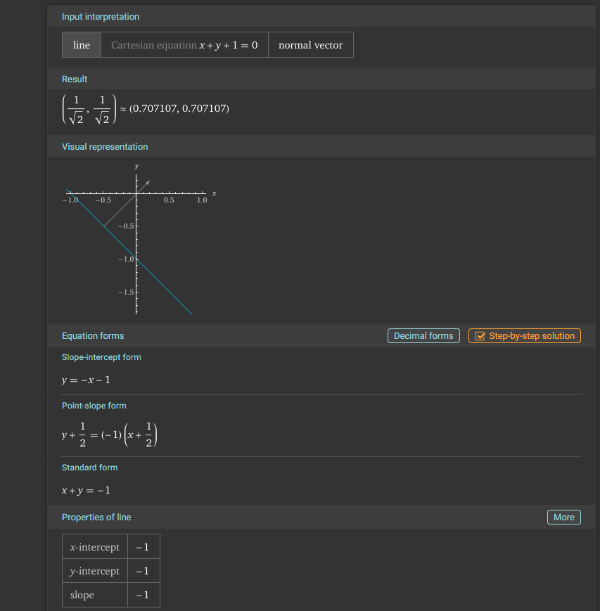

## Tasks related to equations of lines on a plane

**Visualize each task.** - Python, GeoGebra, Wolfram Alpha, ...

* The line passes through points $A(1, 2)$ and $B(3, 4)$. Find the equation of the line.
* The line passes through point $A(1, 2)$ and is parallel to the line $y = 2x + 3$. Find the equation of the line.
* The line passes through point $A(1, 2)$ and is perpendicular to the line $y = 2x + 3$. Find the equation of the line.
* We have two lines $y = 2x + 3$ and $y = 3x + 2$. Find the intersection point of these lines and calculate the angle between them.
* Write the equation of the line passing through point $A(1, 2)$ and parallel to the vector $\vec{v} = [2, 3]$.
* We have the line $y = 2x + 3$. Find an example of a line perpendicular and parallel to it.
* We have the line $y = 2x + 3$ and point $A(1, 2)$. Find the distance from point $A$ to the line.
* The line intersects the coordinate axes at points $A(2, 0)$ and $B(0, 3)$. Find the equation of the line.
* Calculate the angle between the line $y = x + 3$ and the $Ox$ axis.
* Provide a vector perpendicular to the line $x + y + 1 = 0$.
# 1

# 2

# 3

# 4

# 5

# 6

# 7

# 8

# 9

# 10

# 11
