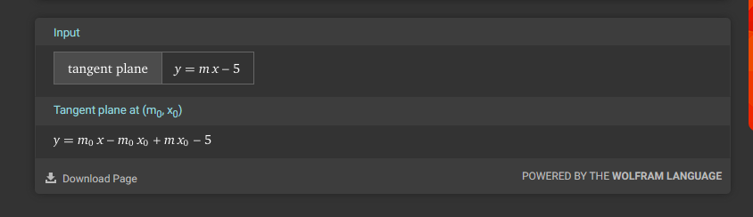

## Tasks related to conic sections

**Visualize each task.** - Python, GeoGebra, Wolfram Alpha, ...

* Find the equation of a circle with center at point $A(1,2)$ and radius $r=3$.
* Find the equation of a parabola intersecting the $Ox$ axis at points $x=2$, $x=4$, and passing through point $y(3)=1$.
* Find the center of the ellipse with the equation $x^2 + 4y^2 - 4x - 16y + 16 = 0$.
* Find the slope ($m>0$) of the line $y=mx-5$ that is tangent to the circle with the equation $x^2 + y^2=1$.
* Find the intersection points of the hyperbola $x^2 - y^2 = 1$ with the ellipse's line $x^2 + 4y^2 = 6$.
* For the given hyperbola $x^2 - y^2 = 1$, find the distance between its branches.
# 1

# 2

# 3

# 4

# 5

# 6
