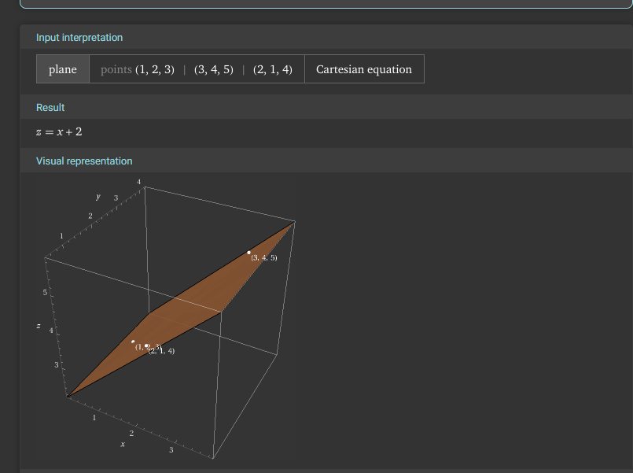
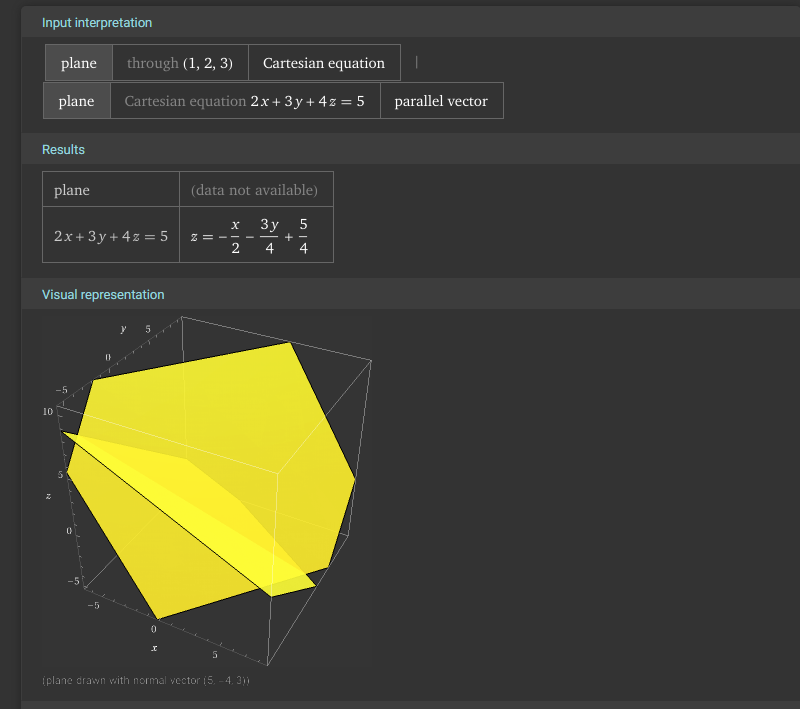
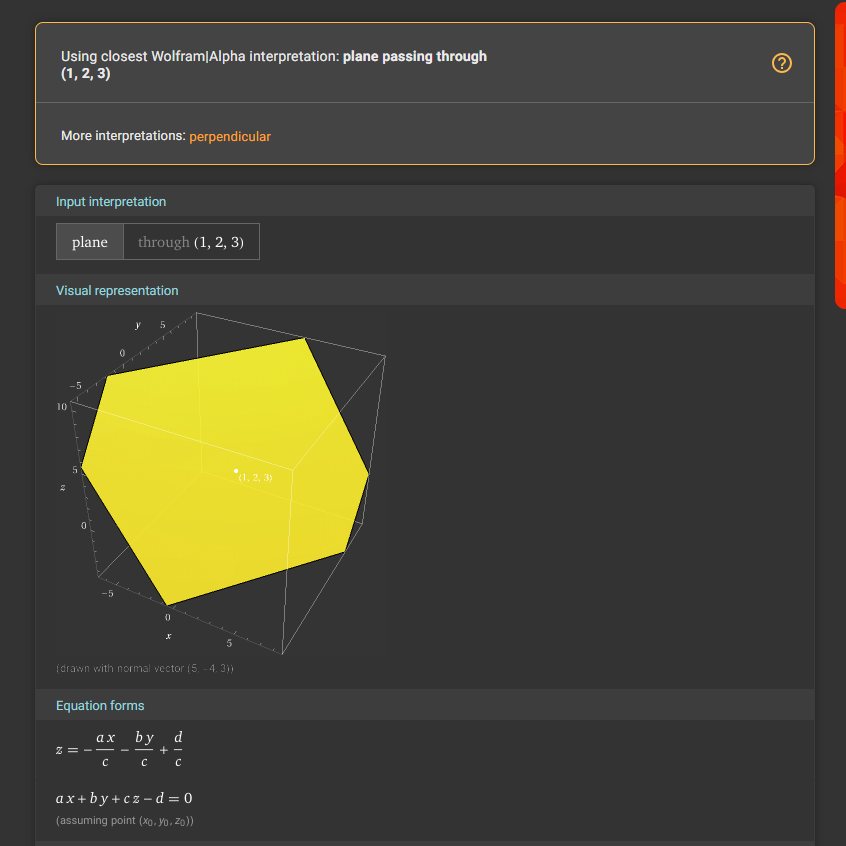
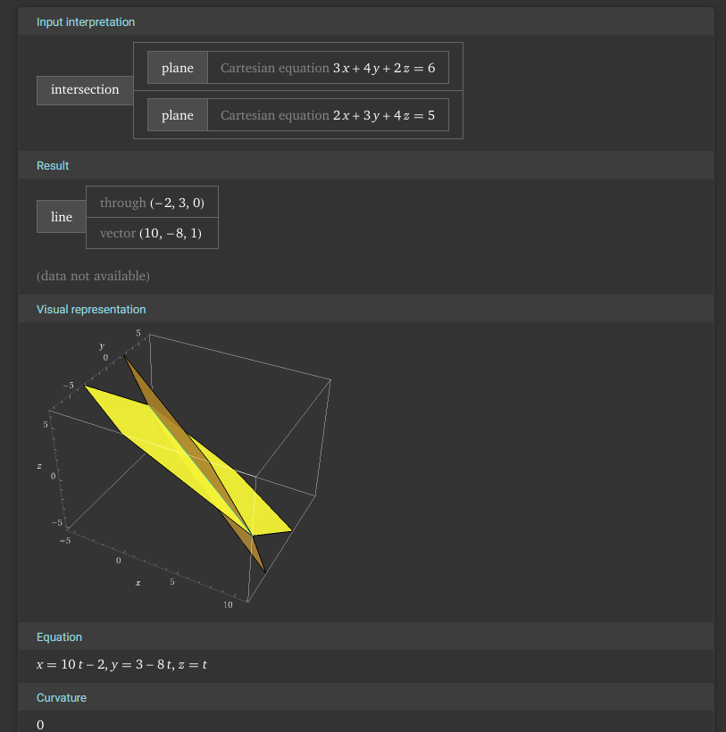
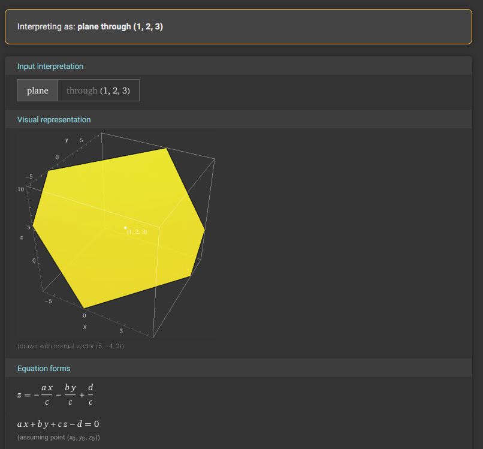
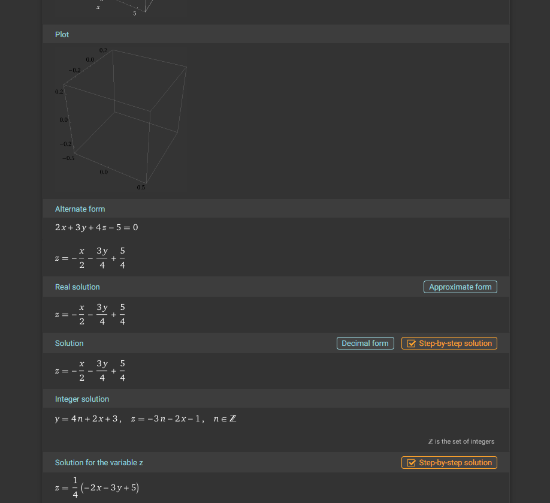
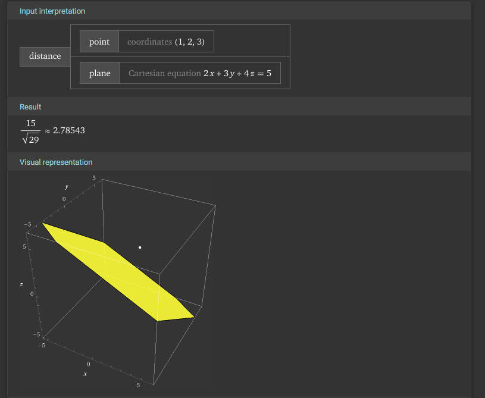
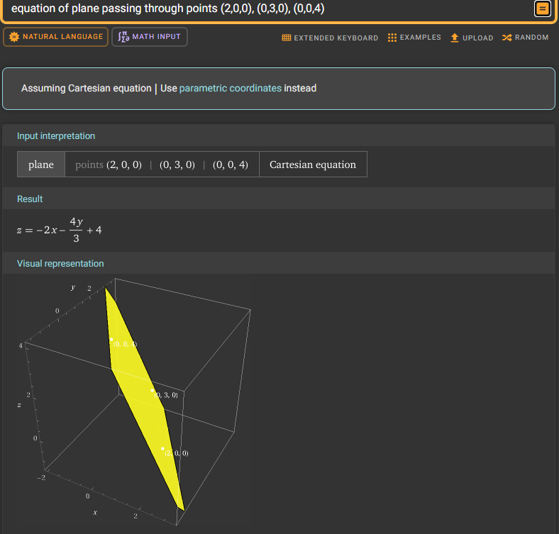
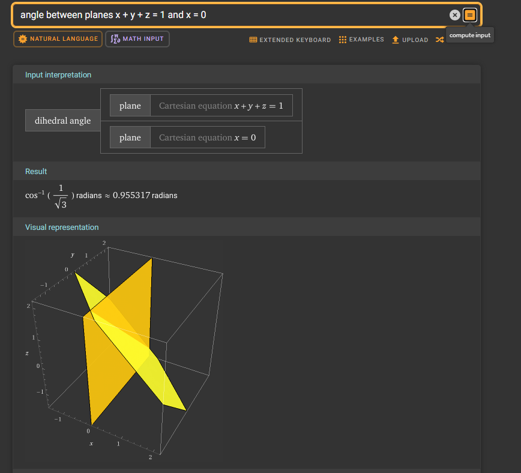
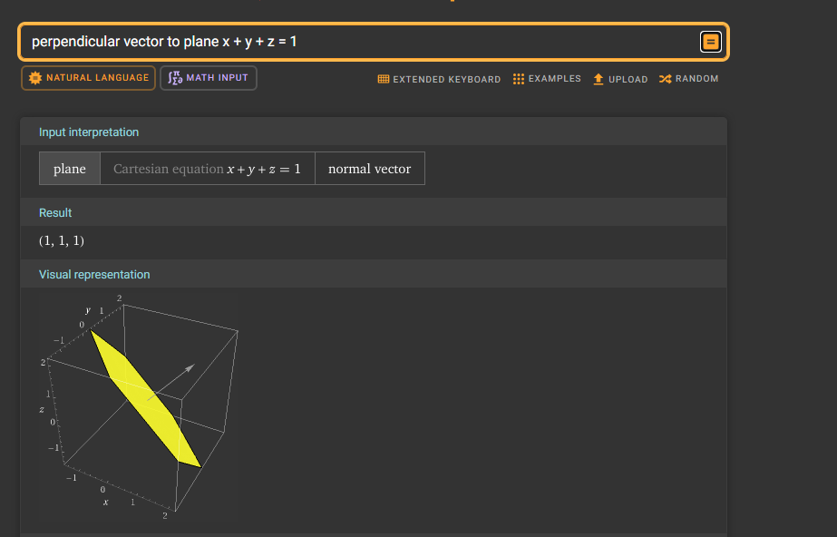

## Tasks related to equations of planes in space

**Visualize each task.** - Python, GeoGebra, Wolfram Alpha, ...

* The plane passes through points $A(1, 2, 3)$, $B(3, 4, 5)$, and $C(2, 1, 4)$. Find the equation of the plane.
* The plane passes through point $A(1, 2, 3)$ and is parallel to the plane $2x + 3y + 4z = 5$. Find the equation of the plane.
* The plane passes through point $A(1, 2, 3)$ and is perpendicular to the normal vector $\vec{n} = [2, 3, 4]$. Find the equation of the plane.
* We have two planes $2x + 3y + 4z = 5$ and $3x + 4y + 2z = 6$. Find the line of intersection of these planes.
* Write the equation of the plane passing through point $A(1, 2, 3)$ and parallel to vectors $\vec{v_1} = [1, 0, 1]$ and $\vec{v_2} = [0, 1, -1]$.
* We have the plane $2x + 3y + 4z = 5$. Find an example of a plane parallel and perpendicular to it.
* We have the plane $2x + 3y + 4z = 5$ and point $A(1, 2, 3)$. Find the distance from point $A$ to this plane.
* The plane intersects the coordinate axes at points $A(2, 0, 0)$, $B(0, 3, 0)$, and $C(0, 0, 4)$. Find the equation of the plane.
* Calculate the angle between the plane $x + y + z = 1$ and the plane $x = 0$ (i.e., the $yz$ plane).
* Find the vector perpendicular to the plane $x + y + z = 1$.
# 1

# 2

# 3

# 4

# 5

# 6

# 7

# 8

# 9

# 10
