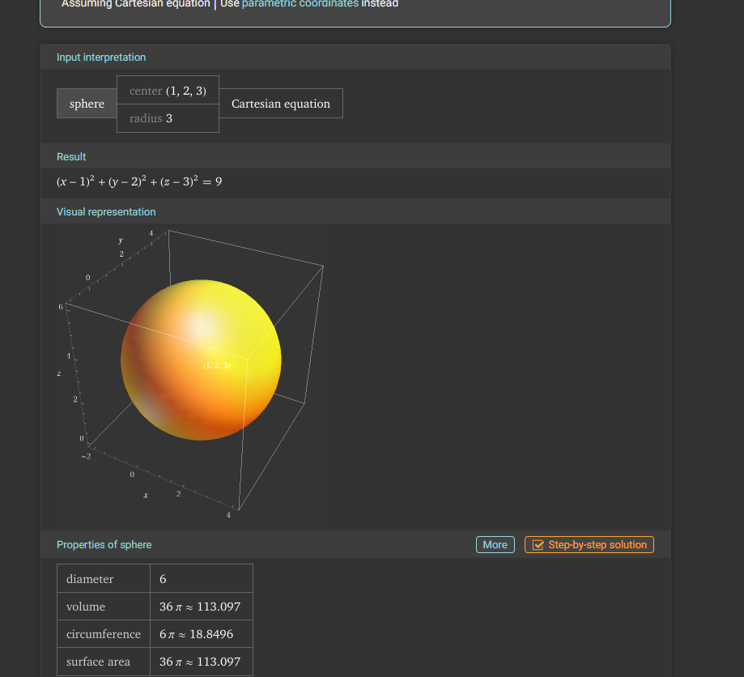
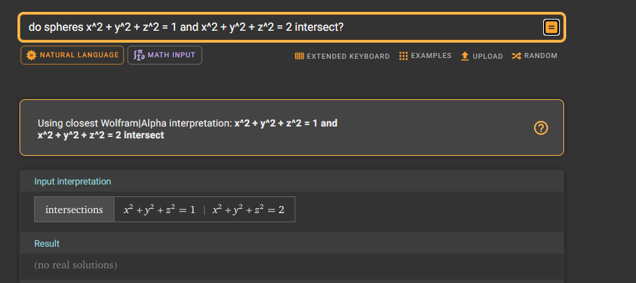
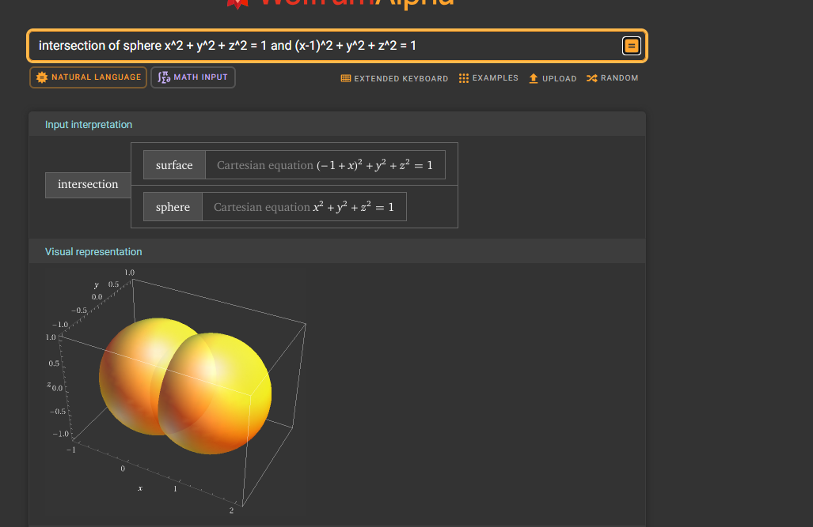
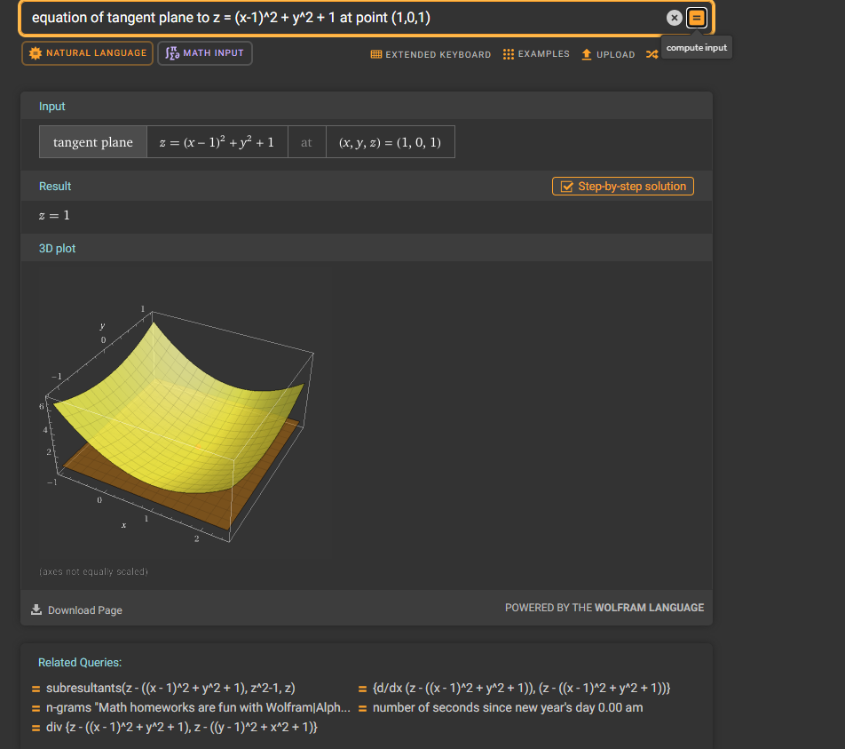

# Tasks related to second-order surfaces

**Visualize each task.** - Python, GeoGebra, Wolfram Alpha, ...

* Write the equation of a sphere with center at point $P=(1,2,3)$ and radius $r=3$.
* Do the spheres with equations $x^2 + y^2 + z^2 = 1$ and $x^2 + y^2 + z^2 = 2$ have any common points?
* What curve in space is formed by the intersection of the sphere $x^2 + y^2 + z^2 = 1$ with the sphere $(x-1)^2 + y^2 + z^2 = 1$? Find the equation of this curve.
* Write the equation of the tangent plane to the paraboloid $z=(x-1)^2+y^2+1$ at point $P=(1,0,1)$.

# 1-

# 2-

# 3-

# 4-
